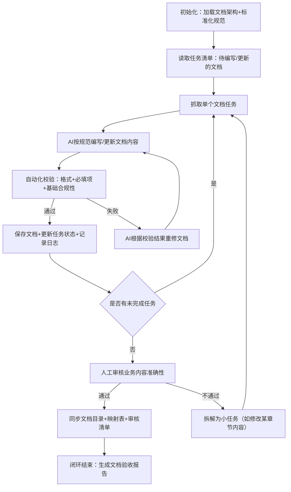

# 基于Ralph Loop的YYC3-AI-LANDING文档闭环设计

你希望针对YYC3-AI-LANDING项目已有的标准化文档架构（13个目录、109个文件），设计一套适配文档构建场景的Ralph Loop AI自动化闭环方案，核心目标是用AI替代人工完成**标准化文档的编写、校验、更新、同步**，仅保留人类对业务核心内容的审核决策，实现文档全生命周期的自动化闭环管理。

文档场景与代码开发场景的核心差异是：文档以「结构化文本、标准化格式、业务逻辑准确性」为核心，而非「代码运行正确性」。因此需要对Ralph Loop做场景化改造，以下是完整的闭环设计方案。

## 一、文档场景下Ralph Loop的核心适配改造

先明确文档闭环与代码闭环的核心差异，针对性调整Loop逻辑：

| 维度         | 代码开发Ralph Loop       | 文档构建Ralph Loop         |
|--------------|--------------------------|----------------------------|
| 核心目标     | 代码可运行、无Bug        | 文档完整、格式合规、内容匹配项目 |
| 最小任务单元 | 单个功能/代码模块        | 单个文档文件（如003-需求说明书.md） |
| 验收标准     | 代码运行结果符合预期     | 文档包含所有必填章节、格式合规、内容无业务错误 |
| 迭代触发     | 代码测试失败             | 文档校验（格式/内容）不通过 |
| 核心工具链   | 代码AI（Claude Code/Cursor） | 文本AI（Claude 3.5/Gemini 1.5）+ 格式校验脚本 |

### 文档闭环核心逻辑



## 二、YYC3-AI-LANDING文档闭环完整设计

### 步骤1：闭环前置准备（规范标准化）

文档闭环的核心前提是「规范可量化」，先明确3类核心规范（需固化为文件，供AI读取）：

#### 1.1 文档格式规范（docs/YYC3-AI-LANDING-文档格式规范.md）

```markdown
# YYC3-AI-LANDING文档格式规范
## 1. 文件名规范
- 命名格式：{序号}-YYC3-AI-LANDING-{目录名}-{文档名}.md
- 序号规则：需求规划001-007，项目规划011-016，架构设计021-031...（匹配现有架构）
- 字符要求：仅中文+数字+连字符，无空格/特殊字符

## 2. 内容格式规范
- 标题层级：一级标题#（文档名），二级标题##（章节），三级标题###（子章节），最多四级####
- 列表：无序列表用-，有序列表用数字.
- 代码块：必须带语言标识（如```bash、```python）
- 表格：优先用Markdown标准表格，字段对齐
- 图片：路径统一为./assets/{文档名}-{图片名}.png，需标注图片说明

## 3. 章节规范（按文档类型定义必填章节）
- 项目需求说明书：必填章节=需求背景|功能需求|非功能需求|验收标准|风险说明
- RESTful接口设计标准：必填章节=接口命名规范|请求方式|参数规则|响应格式|错误码规则
- 系统架构设计文档：必填章节=架构概述|技术栈|核心组件|部署拓扑|性能指标
```

#### 1.2 项目核心上下文（docs/YYC3-AI-LANDING-项目上下文.md）

给AI提供固定的项目背景，避免内容偏离：

```markdown
# YYC3-AI-LANDING项目上下文
1. 项目定位：企业级AI Landing页（落地页），支持3D动画、国际化、响应式布局
2. 核心技术栈：前端React+TypeScript、Spline 3D、RESTful API、CI/CD部署
3. 业务目标：展示AI能力、提供服务定价、支持用户咨询、适配多终端
4. 关键约束：需符合企业安全规范、支持多语言（中/英）、页面加载≤2s
```

#### 1.3 文档校验规则（docs/YYC3-AI-LANDING-文档校验规则.json）

供脚本自动校验，量化验收标准：

```json
{
  "通用校验规则": {
    "必填章节覆盖率": 100,
    "格式错误数": 0,
    "文件名匹配度": 100,
    "项目上下文匹配度": ≥90
  },
  "按文档类型细化": {
    "API文档": {
      "接口示例完整性": 100,
      "错误码体系覆盖率": 100
    },
    "测试文档": {
      "测试用例覆盖率": ≥90,
      "测试环境说明完整性": 100
    }
  }
}
```

### 步骤2：任务清单设计（贴合现有文档架构）

按现有13个目录分组，每个文档文件作为**最小任务单元**，以下是核心目录的任务拆解示例：

#### 需求规划目录（YYC3-AI-LANDING-需求规划）任务清单

| 任务ID | 任务内容                          | 验收标准（可量化/非黑即白）| 闭环模式   |
|--------|-----------------------------------|----------------------------------------------------------------------|------------|
| R001   | 编写001-项目章程.md               | 1. 包含项目名称/目标/范围/利益相关者/启动时间；2. 格式符合规范；3. 内容匹配项目上下文 | 人机协作版 |
| R002   | 编写002-可行性分析报告.md         | 1. 包含技术/经济/市场可行性分析；2. 有量化指标（如开发成本≤50万）；3. 格式合规 | 人机协作版 |
| R003   | 编写003-项目需求说明书.md         | 1. 包含所有必填章节；2. AI功能需求匹配企业级AI Landing页定位；3. 无模糊表述（如“优化性能”需量化为“加载≤2s”） | 人机协作版 |
| R004   | 更新006-需求变更管理计划.md       | 1. 基于现有内容补充AI功能的变更流程；2. 格式合规；3. 变更审批节点完整 | 挂机版     |

#### API文档目录（YYC3-AI-LANDING-API文档）任务清单

| 任务ID | 任务内容                          | 验收标准（可量化/非黑即白）| 闭环模式   |
|--------|-----------------------------------|----------------------------------------------------------------------|------------|
| A001   | 编写056-RESTful接口设计标准.md    | 1. 包含所有必填章节；2. 接口命名符合RESTful规范（如GET /api/v1/home）；3. 示例代码可直接复制 | 挂机版     |
| A002   | 编写057-接口错误码体系.md         | 1. 错误码分段（1xxx-系统错误，2xxx-业务错误）；2. 每个错误码有描述+解决方案；3. 格式合规 | 挂机版     |
| A003   | 编写059-首页接口手册.md           | 1. 包含所有首页接口（列表/详情/提交）；2. 每个接口有请求参数/响应示例/错误码；3. 匹配项目技术栈 | 人机协作版 |

#### 测试文档目录（YYC3-AI-LANDING-测试文档）任务清单

| 任务ID | 任务内容                          | 验收标准（可量化/非黑即白）| 闭环模式   |
|--------|-----------------------------------|----------------------------------------------------------------------|------------|
| T001   | 编写081-单元测试规范.md           | 1. 包含前端/后端单元测试规范；2. 覆盖率要求（前端≥80%，后端≥90%）；3. 工具说明（Jest/Pytest） | 挂机版     |
| T002   | 编写084-性能测试方案.md           | 1. 包含测试指标（响应时间/并发数）；2. 测试工具（JMeter）；3. 测试场景（首页加载/接口请求） | 人机协作版 |

### 步骤3：核心闭环脚本设计（改造YYC3-AI-LANDING-DOCS.py）

该脚本是Ralph Loop的执行核心，包含**任务管理、AI调用、文档校验、日志记录、同步更新**五大模块，以下是完整可运行的核心代码：

```python
import os
import json
import time
import anthropic
from dotenv import load_dotenv
from pathlib import Path

# 加载环境变量（.env文件配置ANTHROPIC_API_KEY=你的密钥）
load_dotenv()
client = anthropic.Anthropic(api_key=os.getenv("ANTHROPIC_API_KEY"))

# 项目配置
PROJECT_ROOT = Path(__file__).parent  # docs目录
DOC_STRUCTURE = PROJECT_ROOT / "YYC3-AI-LANDING-文档映射目录.md"
VALIDATE_RULES = PROJECT_ROOT / "YYC3-AI-LANDING-文档校验规则.json"
PROJECT_CONTEXT = PROJECT_ROOT / "YYC3-AI-LANDING-项目上下文.md"
FORMAT_SPEC = PROJECT_ROOT / "YYC3-AI-LANDING-文档格式规范.md"
LOG_FILE = PROJECT_ROOT / "YYC3-AI-LANDING-DOCS-LOG.md"

# 任务清单（可从JSON文件加载，此处简化为字典）
TASK_LIST = {
    # 需求规划任务
    "R001": {
        "file_path": PROJECT_ROOT / "YYC3-AI-LANDING-需求规划/001-YYC3-AI-LANDING-需求规划-项目章程.md",
        "content_desc": "编写YYC3-AI-LANDING项目章程，包含项目名称/目标/范围/利益相关者/启动时间",
        "acceptance_criteria": "1. 包含所有必填章节；2. 格式符合规范；3. 内容匹配项目上下文",
        "loop_mode": "human_collab",  # 人机协作版
        "status": "pending"  # pending/running/passed/failed
    },
    # API文档任务（示例）
    "A001": {
        "file_path": PROJECT_ROOT / "YYC3-AI-LANDING-API文档/056-YYC3-AI-LANDING-API文档-通用规范-RESTful接口设计标准.md",
        "content_desc": "编写RESTful接口设计标准，包含接口命名/请求方式/参数规则/响应格式/错误码规则",
        "acceptance_criteria": "1. 包含所有必填章节；2. 接口命名符合RESTful规范；3. 示例代码可直接复制",
        "loop_mode": "afk",  # 挂机版
        "status": "pending"
    },
    # 可扩展更多任务...
}

class DocRalphLoop:
    def __init__(self):
        # 加载基础规范
        self.context = self._read_file(PROJECT_CONTEXT)
        self.format_spec = self._read_file(FORMAT_SPEC)
        self.validate_rules = json.loads(self._read_file(VALIDATE_RULES))
        # 初始化日志
        self._init_log()

    def _read_file(self, file_path):
        """读取文件内容，处理编码问题"""
        try:
            with open(file_path, "r", encoding="utf-8") as f:
                return f.read()
        except Exception as e:
            self._log(f"读取文件失败 {file_path}：{str(e)}")
            return ""

    def _write_file(self, file_path, content):
        """写入文档，自动创建目录"""
        try:
            file_path.parent.mkdir(parents=True, exist_ok=True)
            with open(file_path, "w", encoding="utf-8") as f:
                f.write(content)
            self._log(f"成功写入文档：{file_path}")
            return True
        except Exception as e:
            self._log(f"写入文件失败 {file_path}：{str(e)}")
            return False

    def _init_log(self):
        """初始化日志文件"""
        if not LOG_FILE.exists():
            self._write_file(LOG_FILE, "# YYC3-AI-LANDING文档闭环日志\n")

    def _log(self, content):
        """记录日志（带时间戳）"""
        timestamp = time.strftime("%Y-%m-%d %H:%M:%S", time.localtime())
        log_content = f"\n## {timestamp}\n{content}"
        with open(LOG_FILE, "a", encoding="utf-8") as f:
            f.write(log_content)

    def _call_ai(self, task):
        """调用Claude编写/更新文档"""
        prompt = f"""
        你是YYC3-AI-LANDING项目的文档工程师，需按以下要求完成文档编写：
        
        ### 项目上下文（必须严格匹配）
        {self.context}
        
        ### 格式规范（必须严格遵守）
        {self.format_spec}
        
        ### 任务要求
        文档路径：{task['file_path']}
        编写内容：{task['content_desc']}
        验收标准：{task['acceptance_criteria']}
        
        ### 输出要求
        1. 直接输出完整的Markdown文档内容，无需额外说明；
        2. 严格遵循格式规范，标题层级、列表、代码块符合要求；
        3. 内容需量化，避免模糊表述（如“优化性能”需改为“页面加载≤2s”）；
        4. 匹配项目上下文，符合YYC3-AI-LANDING的AI Landing页定位。
        """

        try:
            response = client.messages.create(
                model="claude-3-5-sonnet-20240620",
                max_tokens=8000,
                temperature=0.1,  # 低随机性，保证标准化
                messages=[{"role": "user", "content": prompt}]
            )
            return response.content.strip()
        except Exception as e:
            self._log(f"AI调用失败：{str(e)}")
            return ""

    def _validate_doc(self, task, doc_content):
        """文档自动化校验（格式+必填项+基础合规性）"""
        errors = []
        file_path = task["file_path"]
        
        # 1. 文件名校验
        file_name = file_path.name
        if not file_name.startswith(f"{file_name.split('-')[0]}-YYC3-AI-LANDING-"):
            errors.append(f"文件名不符合规范：{file_name}")
        
        # 2. 必填章节校验（简化示例，可扩展更细规则）
        if "项目章程" in file_name:
            required_sections = ["项目名称", "项目目标", "项目范围", "利益相关者"]
            for section in required_sections:
                if section not in doc_content:
                    errors.append(f"缺失必填章节：{section}")
        
        # 3. 格式校验（标题层级、代码块）
        if "# " not in doc_content:  # 无一级标题
            errors.append("缺失一级标题（# 文档名）")
        if "```" in doc_content and "```python" not in doc_content and "```bash" not in doc_content:
            errors.append("代码块未指定语言标识")
        
        # 4. 项目上下文匹配度（简单关键词校验）
        core_keywords = ["AI Landing页", "React", "TypeScript", "Spline 3D"]
        match_count = sum(1 for keyword in core_keywords if keyword in doc_content)
        if match_count < len(core_keywords) * 0.8:
            errors.append(f"项目上下文匹配度不足，仅匹配{match_count}个核心关键词")
        
        # 返回校验结果
        if errors:
            self._log(f"文档校验失败 {file_path}：{'; '.join(errors)}")
            return False, errors
        else:
            self._log(f"文档校验通过 {file_path}")
            return True, []

    def _human_review_prompt(self, task):
        """人机协作版：提示人工审核"""
        print(f"\n===== 需人工审核任务 {task['file_path'].name} =====")
        print(f"验收标准：{task['acceptance_criteria']}")
        print(f"文档路径：{task['file_path']}")
        while True:
            choice = input("审核结果（通过/不通过/修改）：")
            if choice == "通过":
                return True, []
            elif choice == "不通过":
                reason = input("不通过原因：")
                return False, [reason]
            elif choice == "修改":
                suggestion = input("修改建议：")
                return False, [suggestion]
            else:
                print("请输入 通过/不通过/修改")

    def run_loop(self):
        """启动Ralph Loop核心循环"""
        self._log("===== 启动YYC3-AI-LANDING文档闭环 =====")
        
        # 遍历所有任务
        for task_id, task in TASK_LIST.items():
            if task["status"] == "passed":
                continue  # 跳过已完成任务
            
            self._log(f"\n开始处理任务 {task_id}：{task['file_path'].name}")
            task["status"] = "running"
            retry_count = 0
            max_retry = 3  # 最大重试次数
            
            # 单任务迭代闭环
            while retry_count < max_retry:
                # 1. AI编写/更新文档
                doc_content = self._call_ai(task)
                if not doc_content:
                    retry_count += 1
                    self._log(f"任务 {task_id} AI返回为空，重试第{retry_count}次")
                    time.sleep(2)
                    continue
                
                # 2. 自动化校验
                validate_pass, errors = self._validate_doc(task, doc_content)
                
                # 3. 人机协作版：触发人工审核
                if task["loop_mode"] == "human_collab":
                    human_pass, human_errors = self._human_review_prompt(task)
                    if not human_pass:
                        validate_pass = False
                        errors = human_errors
                
                # 4. 校验通过：保存文档
                if validate_pass:
                    self._write_file(task["file_path"], doc_content)
                    task["status"] = "passed"
                    self._log(f"任务 {task_id} 完成")
                    break
                
                # 5. 校验失败：重试
                retry_count += 1
                self._log(f"任务 {task_id} 校验失败，重试第{retry_count}次，原因：{errors}")
                time.sleep(3)  # 重试间隔
            
            # 任务重试耗尽仍失败
            if retry_count >= max_retry:
                task["status"] = "failed"
                self._log(f"任务 {task_id} 重试{max_retry}次仍失败，标记为失败")
        
        # 闭环结束：更新文档映射目录
        self._update_doc_mapping()
        self._log("===== 文档闭环执行完成 =====")
        print("\n闭环执行完成，日志已保存至：", LOG_FILE)

    def _update_doc_mapping(self):
        """自动更新文档映射目录（YYC3-AI-LANDING-文档映射目录.md）"""
        mapping_content = "# YYC3-AI-LANDING文档映射目录\n\n"
        # 按目录分组生成映射
        dir_tasks = {}
        for task in TASK_LIST.values():
            dir_name = task["file_path"].parent.name
            if dir_name not in dir_tasks:
                dir_tasks[dir_name] = []
            dir_tasks[dir_name].append({
                "name": task["file_path"].name,
                "status": task["status"]
            })
        
        # 生成映射内容
        for dir_name, tasks in dir_tasks.items():
            mapping_content += f"## {dir_name}\n"
            for task in tasks:
                status_tag = "✅" if task["status"] == "passed" else "❌" if task["status"] == "failed" else "🔄"
                mapping_content += f"- {status_tag} {task['name']}\n"
        
        # 写入映射文件
        self._write_file(DOC_STRUCTURE, mapping_content)

if __name__ == "__main__":
    # 启动文档闭环
    doc_loop = DocRalphLoop()
    doc_loop.run_loop()
```

### 步骤4：闭环运行配置与执行

#### 4.1 环境准备

```bash
# 进入docs目录
cd /path/to/YYC3-AI-LANDING/docs

# 安装依赖
pip install anthropic python-dotenv

# 创建.env文件，配置API密钥
echo "ANTHROPIC_API_KEY=你的Claude API密钥" > .env
```

#### 4.2 闭环运行策略

| 闭环模式   | 运行时机          | 适用文档类型                | 运行方式                          |
|------------|-------------------|-----------------------------|-----------------------------------|
| 挂机版     | 夜间/非工作时间   | 标准化高的文档（接口规范、测试规范） | 直接运行脚本，无人值守            |
| 人机协作版 | 工作时间          | 需业务决策的文档（项目章程、可行性分析） | 运行脚本，在提示时人工审核/给出修改建议 |

#### 4.3 执行命令

```bash
# 运行完整闭环
python YYC3-AI-LANDING-脚本工具/YYC3-AI-LANDING-DOCS.py

# 如需仅运行指定目录的任务（可扩展脚本参数）
python YYC3-AI-LANDING-脚本工具/YYC3-AI-LANDING-DOCS.py --dir "YYC3-AI-LANDING-API文档"
```

### 步骤5：验收与迭代

1. **AI自动化验收**：脚本自动校验格式、必填项、上下文匹配度，生成日志；
2. **人工业务验收**：聚焦人机协作版文档的业务准确性（如可行性分析的成本数据、需求说明书的功能边界）；
3. **迭代优化**：将验收不通过的问题拆解为小任务（如“修改003-需求说明书的AI功能需求章节”），重新加入闭环运行；
4. **文档同步**：脚本自动更新「文档映射目录.md」，标记各文档状态（✅完成/❌失败/🔄进行中）。

## 三、关键优化与避坑指南

### 3.1 核心优化技巧

1. **规范固化优先**：文档闭环的效果取决于规范的量化程度，提前花1小时明确规范，可节省10小时的AI返工时间；
2. **任务分组执行**：按目录分组运行闭环（如先跑API文档，再跑测试文档），避免单次处理过多任务导致AI混乱；
3. **日志复用**：将每次闭环的失败原因整理为「文档常见问题库」，下次启动闭环前让AI先学习，避免重复踩坑；
4. **增量更新**：对已存在的文档，让AI仅更新指定章节（而非重写全文），提升效率。

### 3.2 常见坑与解决方案

| 常见坑                | 解决方案                                                                 |
|-----------------------|--------------------------------------------------------------------------|
| AI生成内容模糊        | 需求描述中强制要求“量化指标”（如“性能优化”→“页面加载≤2s”）|
| 格式校验遗漏          | 扩展`_validate_doc`方法，加入更多规则（如标题层级检查、表格格式检查）|
| 业务内容不准确        | 人机协作版重点审核业务内容，AI仅负责格式和标准化内容；提供更详细的项目上下文 |
| API调用成本过高       | 控制单文档的tokens数量（≤8000），对长文档拆分章节逐个生成；使用低频次的模型 |
| 文档版本混乱          | 闭环中加入版本控制（如文档末尾自动添加“更新时间/迭代版本”），对接Git自动提交 |

## 四、总结

### 核心要点回顾

1. **文档闭环的核心是「标准化」**：先固化格式、内容、验收标准，再让AI按规则执行，避免模糊性导致的返工；
2. **任务拆解适配文档特点**：以「单个文档文件」为最小任务单元，标准化高的文档用挂机版，需业务决策的用人机协作版；
3. **人机分工明确**：AI负责文档的编写、格式校验、重复更新，人类聚焦业务内容审核和规范制定，最大化提效；
4. **脚本是闭环的核心载体**：通过改造YYC3-AI-LANDING-DOCS.py，实现任务管理、AI调用、校验、同步的自动化。

这套闭环方案可直接落地到你的YYC3-AI-LANDING文档架构中，初期可先从标准化程度高的目录（如API文档、测试文档）入手跑通闭环，再逐步扩展到所有目录，最终实现80%以上的文档工作由AI自动化完成，人类仅需1小时审核即可完成原本8小时的文档编写工作。
